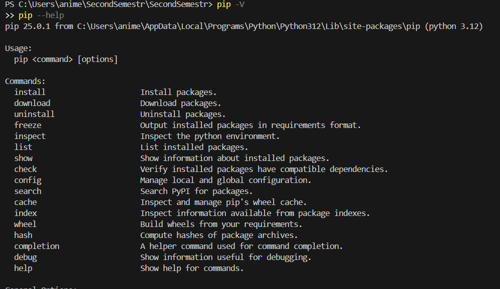
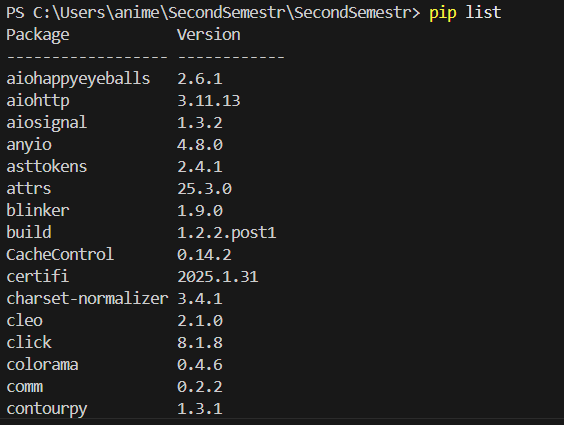
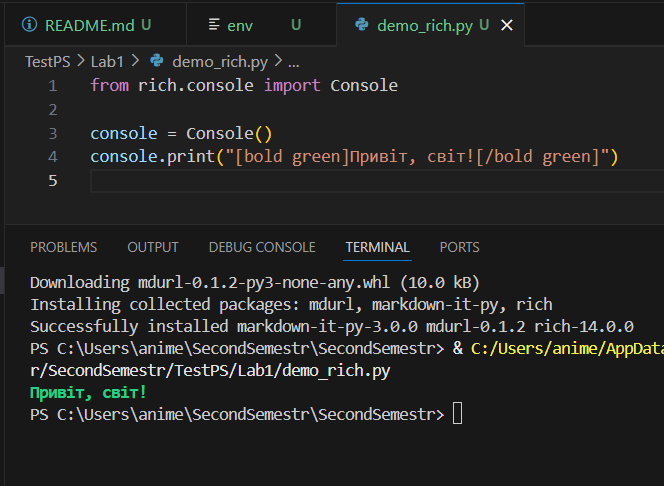
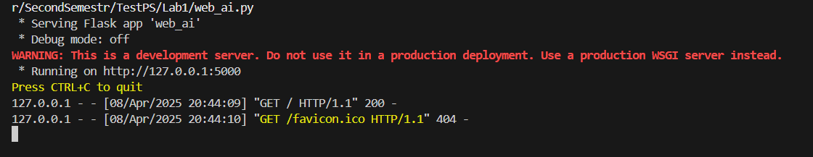
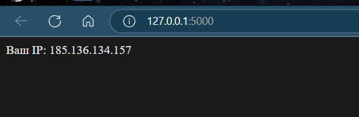

# Лабораторна робота: Віртуальні середовища, Pipenv та Poetry

## Тема
Робота з віртуальними середовищами, менеджерами пакетів pip, pipenv, poetry.

## Мета роботи
Навчитись створювати віртуальні середовища Python, використовувати pipenv і poetry для управління залежностями та середовищами. Ознайомитись із роботою зі сторонніми бібліотеками.

---

## Хід роботи

### 1. Перевірка PIP
```bash
pip -V
pip --help
```


### 2. Перевірка встановлених бібліотек
```bash
pip list
```


### 3. Встановлення бібліотеки `requests`
```bash
pip install requests
```
```python
>>> import requests
>>> r = requests.get('https://google.com')
>>> r.status_code
```

### 4. Інформація про бібліотеку
```bash
pip show requests
pip install requests==2.1
pip show requests
pip uninstall requests
```

---

### 5. Використання бібліотеки `jikanpy` (API MyAnimeList)
Файл: `anime_flask_app.py`

```python
from flask import Flask, render_template
from jikanpy import Jikan

jikan = Jikan()
app = Flask(__name__)

j = jikan.anime(54595, extension='episodes')

@app.route('/')
def home():
    a = str()
    for episode in j["data"]:
        a += f"<p>Епізод {episode['mal_id']} з назвою: {episode['title']} має оцінку {episode['score']}<p>"
    return a

@app.route('/about')
def about():
    return render_template('about.html')

if __name__ == '__main__':
    app.run(debug=True)
```

⏬ *Вставити результат запуску програми*

---

### 6. Робота з VENV
```bash
python -m venv ./my_env
source my_env/Scripts/activate
pip install requests
deactivate
pip show requests
```
⏬ *Вставити пояснення: чому `pip show requests` нічого не показує після деактивації*

---

### 7. Робота з Pipenv
```bash
pip install pipenv
pipenv --help
pipenv --python 3.10
pipenv install requests
pipenv shell
```

Файл: `main_requests.py`
```python
import requests

response = requests.get('https://httpbin.org/')
for line in response.iter_lines():
    print(line)
```

---

### 8. Робота з PyPi (власна бібліотека)
```bash
pipenv install rich
```

Файл: `demo_rich.py`
```python
from rich.console import Console

console = Console()
console.print("[bold green]Привіт, світ![/bold green]")
```

---

### 9. Зміна інтерпретатора у VS Code

---

### 10. Змінні середовища
Файл `.env`
```
HELLO=Привіт
```

Файл: `env_test.py`
```python
import os
print(os.environ['HELLO'])
```

---

### 11. Робота з Poetry
```bash
poetry new myproject
cd myproject
poetry add requests
poetry shell
poetry show
poetry show --tree
```

Файл у myproject:
```python
import requests

r = requests.get("https://httpbin.org/ip")
print("IP:", r.json())
```
---

### 12. Створення простої Flask-програми з використанням AI

Файл: `web_ai.py`
```python
from flask import Flask
import requests

app = Flask(__name__)

@app.route("/")
def hello():
    r = requests.get("https://httpbin.org/ip")
    return f"Ваш IP: {r.json()['origin']}"

if __name__ == "__main__":
    app.run()
```


---

## Висновки:

❓ Що зроблено в роботі:  
✅ Створено віртуальні середовища за допомогою venv, pipenv, poetry.  

❓ Чи досягнуто мети роботи:  
✅ Так.

❓ Які нові знання отримано:  
✅ Навички роботи з pipenv та poetry, робота з бібліотеками `requests`, `jikanpy`, `rich`, Flask.

❓ Чи вдалося виконати всі завдання:  
✅ Так.

❓ Чи виникли складності:  
Можливі проблеми з сумісністю бібліотек, або доступом до API.

❓ Чи подобається формат здачі роботи:  
👍 Так, все структуровано та зручно.

❓ Побажання:  
Більше інтеграції з GitHub Actions / Pytest для перевірки проектів.
