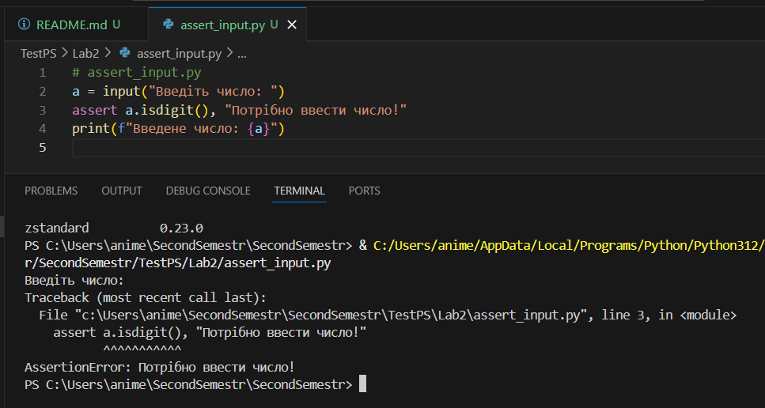
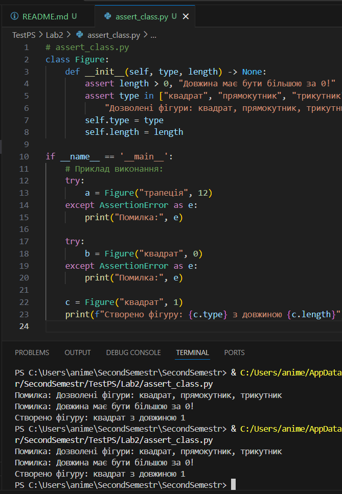
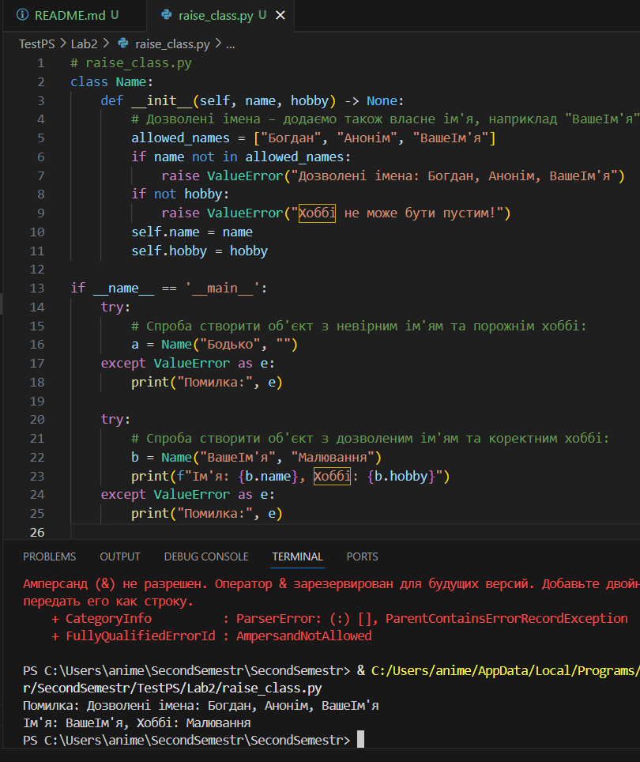
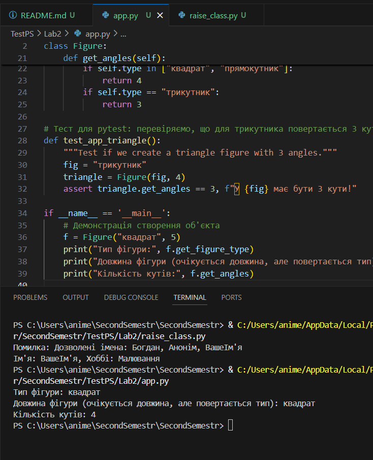
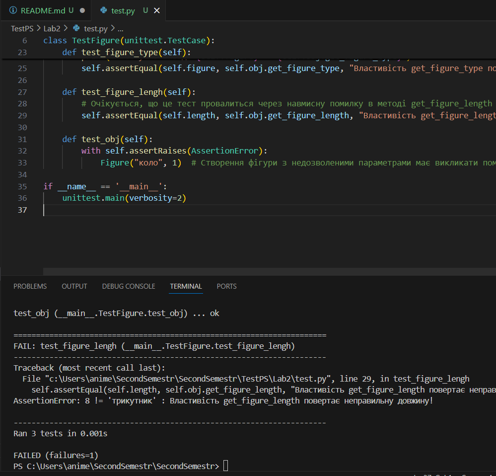

# Лабораторна робота з тестування Python-програм

Ця лабораторна робота присвячена перевірці правильності роботи програм з використанням:
- **assert** для валідації даних,
- **raise** для генерації винятків при невірних аргументах,
- **unit-тестування** з використанням бібліотеки **unittest**,
- **unit-тестування** з використанням **pytest**,
- Вимір покриття коду за допомогою **coverage** та **pytest-cov**.

## Структура проекту

Проект містить такі файли:

- **assert_input.py**  
  Файл демонструє використання `assert` для перевірки введених користувачем даних через функцію `input`.
  
- **assert_class.py**  
  Файл містить простий клас, в якому проводиться валідація аргументів за допомогою `assert`.  
  Приклад: перевірка типу фігури та її довжини.

- **raise_class.py**  
  Файл демонструє використання винятків (`raise ValueError`) для валідації даних класу.  
  До списку дозволених імен додано власне ім'я (наприклад, "ВашеІм'я"). Також додано валідацію для передачі не пустого поля «хоббі».

- **app.py**  
  Основний файл з класом `Figure`, який містить:
  - Валідацію даних при створенні об'єкта.
  - Властивості **get_figure_type**, **get_figure_length** (навмисно зроблено помилку для демонстрації невірної роботи) та **get_angles** для визначення кількості кутів.
  - Приклад тестової функції для PyTest.

- **test.py**  
  Файл з unit-тестами на основі бібліотеки `unittest` для перевірки класу `Figure`.  
  У тестах реалізовано:
  - Перевірку правильності повернення типу фігури.
  - Перевірку помилки у властивості `get_figure_length` (як приклад навмисної помилки).
  - Перевірку створення об'єкта з недозволеними параметрами (має викликатися `AssertionError`).

## Інструкції до виконання лабораторної роботи

### 1. Запуск перевірок з використанням assert

- **assert_input.py**  
  Запустіть цей файл у терміналі командою:
  ```bash
  python assert_input.py
  ```
  Програма запропонує ввести число. Якщо введене значення не є числом – буде викликаний `AssertionError`.
  

- **assert_class.py**  
  Створіть об’єкти класу `Figure` з різними параметрами. Наприклад, спробуйте наступні комбінації:
  - `Figure("квадрат", 1)` – працює нормально.
  - `Figure("трапеція", 12)` – викликається AssertionError через невірно вказаний тип.
  - `Figure("квадрат", 0)` – викликається AssertionError через невірну довжину.
  

### 2. Перевірка роботи класу з підняттям винятків (raise)

- **raise_class.py**  
  Створіть об'єкт класу `Name`, наприклад:
  ```python
  a = Name("Бодько", "футбол")
  ```
  Якщо ім'я не знаходиться у дозволених значеннях (зокрема додайте в список власне ім'я, наприклад, "ВашеІм'я") або поле хоббі порожнє – має бути піднято виняток.
  

### 3. Юніт-тести з використанням unittest

- **app.py та test.py**  
  Запустіть тести за допомогою наступної команди з терміналу:
  ```bash
  python -m unittest
  ```
  Або, для більш детального виводу:
  ```bash
  python -m unittest -v
  ```
  У тестах:
  - Тест `test_figure_type` перевіряє коректність повернення типу фігури.
  - Тест `test_figure_lengh` перевіряє властивість `get_figure_length` (очікується помилка, оскільки повертається тип, а не довжина).
  - Тест `test_obj` перевіряє створення об’єкта з невірними параметрами.

  **Результат виконання:**  
  - Тести, що порівнюють властивість типу, працюватимуть коректно.
  - Тест на довжину провалиться через помилку в логіці (це показує, що код потребує виправлення).
  - Тест на створення об’єкта з невірними параметрами має викликати AssertionError, що підтверджує валідацію.
  
  

### 4. Юніт-тести з використанням PyTest

- Встановіть залежності (якщо використовуєте pipenv або poetry):  
  Наприклад, для poetry:
  ```bash
  poetry add --dev pytest
  ```
- Запустіть простий тест, який знаходиться у файлі **app.py**:
  ```bash
  poetry run pytest app.py
  ```
  **Результат виконання:**  
  Функція `test_app_triangle` має запуститися і перевірити, що для "трикутника" повертається правильне значення типу.

- Для запуску всіх тестів із файлу **test.py**:
  ```bash
  poetry run pytest test.py
  ```

### 5. Вимір покриття коду (Coverage)

- Встановіть залежності для coverage:
  ```bash
  poetry add --dev coverage pytest-cov
  ```
- Запустіть тести та зберіть дані покриття:
  ```bash
  poetry run pytest --cov=app test.py
  ```
- Для генерації HTML-звіту:
  ```bash
  poetry run python -m coverage html
  ```
  Після цього відкрийте файл `htmlcov/index.html` у веб-браузері та перегляньте деталі покриття.

### 6. Автоматизація з GitHub Actions

У наступній роботі планується автоматизація запуску тестів за допомогою GitHub Actions. Цей крок дозволить автоматично запускати тести при кожному пуші в репозиторій.

### Додаткові рекомендації

- **.gitignore:**  
  Додайте папку `__pycache__` до файлу `.gitignore`, щоб уникнути коміту кешованих файлів Python.
  
- **Скріншоти та Звіти:**  
  До звіту можна додати скріншоти виконання тестів у Visual Studio Code, консолі, а також HTML-звіт покриття коду для більш наочної демонстрації роботи.


---

## Підсумок

- **Assert-перевірки:**  
  Ми використали твердження `assert` для валідації даних, що вводяться з клавіатури, а також для перевірки коректності параметрів при створенні об'єктів класів.

- **Підняття винятків:**  
  Клас `Name` демонструє, як за допомогою `raise ValueError` можна забезпечувати правильність введених даних (ім'я та хоббі).

- **Юніт тестування:**  
  Тести, написані на базі `unittest`, допомагають перевіряти окремі частини коду. Крім того, ми продемонстрували використання `pytest` для тестування функції в файлі **app.py**.

- **Покриття коду:**  
  За допомогою інструментів **coverage** та **pytest-cov** можна збирати статистику щодо тестового покриття, що дозволяє виявити нерозгалужені ділянки коду. HTML-звіт можна згенерувати і переглянути в браузері.

- **GitHub Actions:**  
  Подальша автоматизація запуску тестів за допомогою GitHub Actions допоможе інтегрувати тестування в процес CI/CD.
